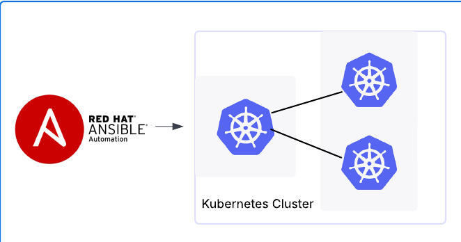

# Kubernetes (k8s) ansible setup
Ansible playbooks for setting up Linux servers and deploying Kubernetes (K8s).



Project Description

This repository contains Ansible playbooks designed to automate the deployment of a Kubernetes cluster using Kubeadm on Linux servers (specifically Ubuntu Server). The main objective of this project is to simplify and standardize the initial setup process of a Kubeadm cluster, from node preparation to the installation of core Kubernetes components. The playbooks handle the installation of necessary dependencies, configure operating system parameters, initialize the Kubeadm control plane, and join the worker nodes to the cluster. Configuration of Calico as the Container Network Interface (CNI) is also included.

Key Features

* Automated initial setup of Ubuntu Server hosts for cluster environments.
* Installation and configuration of necessary operating system prerequisites and dependencies for Kubernetes.
* Automated deployment of the Kubernetes Control Plane using Kubeadm.
* Automated joining and configuration of Worker Nodes to the existing Kubeadm cluster.
* Configuration of Calico as the Container Network Interface (CNI) solution for the cluster network.
* Management of SSH configuration, including automated SSH host key (known_hosts) handling for node-to-node or controller-to-node communication.
* Configuration of Firewall services on the nodes to ensure necessary cluster connectivity (e.g., managing firewalld or nftables).

## Prerequisites

Before using these Ansible playbooks to deploy your Kubernetes cluster, ensure your environment meets the following requirements:

### 1. Control Machine

The machine from which you will execute the `ansible-playbook` commands must have:

* **Operating System:** A compatible Linux-based system (e.g., Ubuntu, Fedora, CentOS/Oracle Linux, macOS, WSL on Windows).
* **Python 3.x:** Python version 3.x installed and correctly configured.
* **Ansible:** Ansible version [Specify minimum version if applicable, e.g., 2.10 or higher] or later installed.
  
    ```bash
    # Installation using pip (recommended in a virtual environment)
    python3 -m pip install ansible

    # Or installation via your distribution's package manager (e.g., on Ubuntu)
    # sudo apt update && sudo apt install ansible
    ```
* **Git:** Git installed to be able to clone this repository.
    ```bash
    # Installation using package manager (e.g., on Ubuntu)
    # sudo apt update && sudo apt install git
    ```
* **kubectl:** **It is not necessary to install `kubectl` manually beforehand.** The playbook will handle the installation of `kubectl` on the control machine (or an accessible location) as part of the deployment process. It will be needed to interact with the cluster *after* the playbook has finished.
* **SSH Key:** An SSH key pair (public and private) configured. The private key will be used to authenticate to the managed nodes. By default, Ansible uses `~/.ssh/id_rsa`.


### 2. Managed Nodes (Ubuntu Server Hosts)

The servers where the Kubernetes components will be installed must meet the following requirements:

* **Operating System:** Servers running **Ubuntu Server** version [Specify exact or minimum version, e.g., 24.04 LTS].
* **SSH Access:** SSH access configured from the control machine to the **`root` user** on **each** of these nodes.
    * **Public Key Configuration:** The **public SSH key** of your control machine must be copied into the `/root/.ssh/authorized_keys` file of the `root` user on **each** of these nodes.
    * [Here you can add a reference to your script if you have one to help with public key distribution]: You can use the `./scripts/[your_ssh_script_name].sh` script included in this repository to automate this step.

    

* **Passwordless `root` Access:** The `root` user must have the ability to execute commands without being prompted for a password (this is often the default configuration for the `root` user, but ensure this is the case on your servers).
* **Python 3.x:** Python version 3.x installed on each managed node.
* **Network Connectivity:**
    * Network connectivity (SSH, port 22 by default) from the control machine to all managed nodes.
    * **Internet access** from each managed node to download packages (APT), container images, and Kubernetes components.


### 3. Ansible Inventory

* Configure your Ansible inventory file (`hosts`).
* Define your master node(s) under the `[master]` group and your worker nodes under the `[worker]` group.
* Ensure you specify the **SSH hostname or IP address** for each node using the `ansible_host` variable.
* Since you are using the `root` user, you might not need to explicitly define `ansible_user` if `root` is the default user Ansible tries. However, if you encounter issues, you can explicitly set `ansible_user=root` under the `[all:vars]` group or within the group/host definitions.
* If you are not using the default SSH private key (`~/.ssh/id_rsa`), you will need to specify the path to your private key file using the `ansible_ssh_private_key_file` variable, either under `[all:vars]` or within the group/host definitions.

```ini
# Example of your Ansible inventory file (./hosts)
[master]
master ansible_host=MASTER_NODE_IP_OR_HOSTNAME

[worker]
worker1 ansible_host=WORKER_NODE_1_IP_OR_HOSTNAME
worker2 ansible_host=WORKER_NODE_2_IP_OR_HOSTNAME
# Add more worker nodes as needed

#[all:vars]
#ansible_user=root
#ansible_ssh_private_key_file=~/.ssh/path/to/your/private_key # Uncomment and adjust if needed

## Installation and Configuration

Follow these steps to deploy your Kubernetes cluster using the Ansible playbooks:

1.  **Clone the Repository:**
    Obtain a local copy of the playbooks and project files by cloning the repository from GitHub.
    ```bash
    git clone [https://github.com/ftavarez01/k8s-ansible-setup.git](https://github.com/ftavarez01/k8s-ansible-setup.git)
    cd k8s-ansible-setup
    ```

2.  **Configure the Ansible Inventory File:**
    Within the cloned repository directory, you will find an inventory file named `hosts`. You need to edit this file to specify the IP addresses or hostnames of your Ubuntu servers where you will deploy Kubernetes.

    Open the `hosts` file with a text editor and update the `[master]` and `[worker]` sections with your server information.

    ```ini
    # Example inventory file (./hosts)
    [master]
    master ansible_host=MASTER_NODE_IP_OR_HOSTNAME

    [worker]
    worker1 ansible_host=WORKER_NODE_1_IP_OR_HOSTNAME
    worker2 ansible_host=WORKER_NODE_2_IP_OR_HOSTNAME
    # Add more worker nodes as needed

    [all:vars]
    ansible_user=root # Ensure 'root' can SSH without a password
    # ansible_ssh_private_key_file=~/.ssh/path/to/your/private_key # Uncomment and adjust if you are not using the default key
    ```

    * **Replace** `MASTER_NODE_IP_OR_HOSTNAME`, `WORKER_NODE_1_IP_OR_HOSTNAME`, `WORKER_NODE_2_IP_OR_HOSTNAME`, etc., with the actual IP addresses or hostnames of your servers.
    * **Verify** that the `root` user has passwordless SSH access configured (using public key authentication).
    * **Optional:** If you are not using the default SSH private key, uncomment and adjust the path to your private key file.

3.  **Ensure SSH Access and Execute the Key Distribution Script:**
    Before running the Ansible playbook, you need to ensure that the public SSH key of your control machine is correctly installed on the managed nodes to allow passwordless authentication.

    If you have included a script to automate this process (for example, `distribute-ssh-keys.sh`), navigate to the directory where the script is located (likely the repository root or a subdirectory like `./scripts/`) and execute it as follows:

    ```bash
    chmod +x distribute-ssh-keys.sh
    ./distribute-ssh-keys.sh
    ```

    * If your script requires additional options or arguments, make sure to provide them. Currently, your script does not appear to need arguments.

    Once the script has been executed successfully on all your managed nodes, SSH access with public key authentication should be configured.

    

4.  **Execute the Deployment Playbook:**
    After configuring your inventory file (`hosts`) and ensuring that SSH access is working correctly, you can execute the Ansible playbook to start the Kubernetes cluster deployment.

    Navigate to the root directory of the cloned repository and run the following Ansible command:

    ```bash
    ansible-playbook -i hosts site.yaml
    ```

    * The `-i hosts` option tells Ansible to use the `hosts` file in the current directory as the inventory. If your inventory file has a different name, adjust it accordingly (e.g., `-i /path/to/my_inventory`).

    Wait for the playbook to complete. The time it takes will depend on the number of nodes and your network speed. Once finished, your Kubernetes cluster should be deployed and configured.

5.  **Verify the Kubernetes Installation:**
    After the Ansible playbook has completed without errors, you can verify that the Kubernetes cluster has been deployed correctly using the `kubectl` tool.

    **From your control machine:**

    Run the following commands:

    ```bash
    kubectl get nodes
    kubectl get pods -n kube-system
    ```

    The `kubectl get nodes` command should show all the nodes in a `Ready` state. The `kubectl get pods -n kube-system` command should show the essential system pods in a `Running` state.

    If the `kubectl get nodes` command does not show the nodes as `Ready` after a few minutes, check the logs of the control plane pods to identify potential errors.

    ```bash
    kubectl logs -n kube-system <apiserver-pod-name>
    ```

    Replace `<apiserver-pod-name>` with the name of the apiserver pod (you can find it with `kubectl get pods -n kube-system`).

    If you continue to experience issues, check the log files on your nodes for more information.

    * On master nodes: `/var/log/kube-apiserver.log`, `/var/log/kube-scheduler.log`, `/var/log/kube-controller-manager.log`
    * On worker nodes: `/var/log/kubelet.log`, `/var/log/kube-proxy.log`

    These logs can provide clues about what is preventing the cluster from starting correctly.

Regarding your repository:

* The main playbook is named `site.yaml`.
* The `distribute-ssh-keys.sh` script does not appear to need arguments, but it's important that the user runs `chmod +x distribute-ssh-keys.sh` to make it executable.
* I've added troubleshooting suggestions, including checking logs, to help users diagnose deployment issues.

What do you think of these changes? Would you like to add anything else, such as instructions for configuring `kubectl` locally?
  
