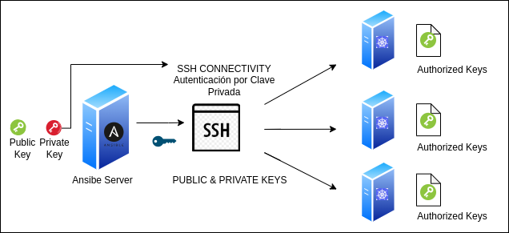

# Kubernetes (k8s) ansible setup
Ansible playbooks for setting up Linux servers and deploying Kubernetes (K8s).


Project Description

This repository contains Ansible playbooks designed to automate the deployment of a Kubernetes cluster using Kubeadm on Linux servers (specifically Ubuntu Server). The main objective of this project is to simplify and standardize the initial setup process of a Kubeadm cluster, from node preparation to the installation of core Kubernetes components. The playbooks handle the installation of necessary dependencies, configure operating system parameters, initialize the Kubeadm control plane, and join the worker nodes to the cluster. Configuration of Calico as the Container Network Interface (CNI) is also included.

Key Features

* Automated initial setup of Ubuntu Server hosts for cluster environments.
* Installation and configuration of necessary operating system prerequisites and dependencies for Kubernetes.
* Automated deployment of the Kubernetes Control Plane using Kubeadm.
* Automated joining and configuration of Worker Nodes to the existing Kubeadm cluster.
* Configuration of Calico as the Container Network Interface (CNI) solution for the cluster network.
* Management of SSH configuration, including automated SSH host key (known_hosts) handling for node-to-node or controller-to-node communication.
* Configuration of Firewall services on the nodes to ensure necessary cluster connectivity (e.g., managing firewalld or nftables).

## Prerequisites

Before using these Ansible playbooks to deploy your Kubernetes cluster, ensure your environment meets the following requirements:

### 1. Control Machine

The machine from which you will execute the `ansible-playbook` commands must have:

* **Operating System:** A compatible Linux-based system (e.g., Ubuntu, Fedora, CentOS/Oracle Linux, macOS, WSL on Windows).
* **Python 3.x:** Python version 3.x installed and correctly configured.
* **Ansible:** Ansible version [Specify minimum version if applicable, e.g., 2.10 or higher] or later installed.
  
    ```bash
    # Installation using pip (recommended in a virtual environment)
    python3 -m pip install ansible

    # Or installation via your distribution's package manager (e.g., on Ubuntu)
    # sudo apt update && sudo apt install ansible
    ```
* **Git:** Git installed to be able to clone this repository.
    ```bash
    # Installation using package manager (e.g., on Ubuntu)
    # sudo apt update && sudo apt install git
    ```
* **kubectl:** **It is not necessary to install `kubectl` manually beforehand.** The playbook will handle the installation of `kubectl` on the control machine (or an accessible location) as part of the deployment process. It will be needed to interact with the cluster *after* the playbook has finished.
* **SSH Key:** An SSH key pair (public and private) configured. The private key will be used to authenticate to the managed nodes. By default, Ansible uses `~/.ssh/id_rsa`.


### 2. Managed Nodes (Ubuntu Server Hosts)

The servers where the Kubernetes components will be installed must meet the following requirements:

* **Operating System:** Servers running **Ubuntu Server** version [Specify exact or minimum version, e.g., 24.04 LTS].
* **SSH Access:** SSH access configured from the control machine to the **`root` user** on **each** of these nodes.
    * **Public Key Configuration:** The **public SSH key** of your control machine must be copied into the `/root/.ssh/authorized_keys` file of the `root` user on **each** of these nodes.
    * [Here you can add a reference to your script if you have one to help with public key distribution]: You can use the `./scripts/[your_ssh_script_name].sh` script included in this repository to automate this step.

    

* **Passwordless `root` Access:** The `root` user must have the ability to execute commands without being prompted for a password (this is often the default configuration for the `root` user, but ensure this is the case on your servers).
* **Python 3.x:** Python version 3.x installed on each managed node.
* **Network Connectivity:**
    * Network connectivity (SSH, port 22 by default) from the control machine to all managed nodes.
    * **Internet access** from each managed node to download packages (APT), container images, and Kubernetes components.


### 3. Ansible Inventory

* Configure your Ansible inventory file ([Specify the actual name of your inventory file, e.g., `inventory` or `hosts`]).
* Define your control plane node(s) under the `[control_plane]` group and your worker nodes under the `[worker]` group.
* Ensure you specify the **SSH hostname or IP address** for each node using the `ansible_host` variable.
* Since you are using the `root` user, you might not need to explicitly define `ansible_user` if `root` is the default user Ansible tries. However, if you encounter issues, you can explicitly set `ansible_user=root` under the `[all:vars]` group or within the group/host definitions.
* If you are not using the default SSH private key (`~/.ssh/id_rsa`), you will need to specify the path to your private key file using the `ansible_ssh_private_key_file` variable, either under `[all:vars]` or within the group/host definitions.

```ini
# Example of your Ansible inventory file (./[Specify the actual name])
[control_plane]
controlplane ansible_host=IP_OR_HOSTNAME_OF_CONTROLPLANE

[worker]
worker1 ansible_host=IP_OR_HOSTNAME_OF_WORKER1
worker2 ansible_host=IP_OR_HOSTNAME_OF_WORKER2
# Add more worker nodes as needed

#[all:vars]
#ansible_user=root
#ansible_ssh_private_key_file=~/.ssh/path/to/your/private_key # Uncomment and adjust if needed

  
