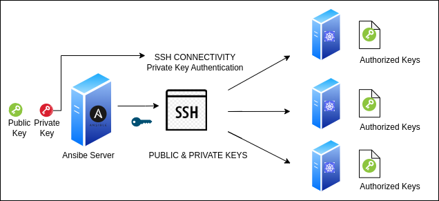

# Kubernetes (k8s) ansible setup
Ansible playbooks for setting up Linux servers and deploying Kubernetes (K8s).


Project Description

This repository contains Ansible playbooks designed to automate the deployment of a Kubernetes cluster using Kubeadm on Linux servers (specifically Ubuntu Server). The main objective of this project is to simplify and standardize the initial setup process of a Kubeadm cluster, from node preparation to the installation of core Kubernetes components. The playbooks handle the installation of necessary dependencies, configure operating system parameters, initialize the Kubeadm control plane, and join the worker nodes to the cluster. Configuration of Calico as the Container Network Interface (CNI) is also included.

Key Features

* Automated initial setup of Ubuntu Server hosts for cluster environments.
* Installation and configuration of necessary operating system prerequisites and dependencies for Kubernetes.
* Automated deployment of the Kubernetes Control Plane using Kubeadm.
* Automated joining and configuration of Worker Nodes to the existing Kubeadm cluster.
* Configuration of Calico as the Container Network Interface (CNI) solution for the cluster network.
* Management of SSH configuration, including automated SSH host key (known_hosts) handling for node-to-node or controller-to-node communication.
* Configuration of Firewall services on the nodes to ensure necessary cluster connectivity (e.g., managing firewalld or nftables).

## Prerequisites

Before using these Ansible playbooks to deploy your Kubernetes cluster, ensure your environment meets the following requirements:

### 1. Control Machine

The machine from which you will execute the `ansible-playbook` commands must have:

* **Operating System:** A compatible Linux-based system (e.g., Ubuntu, Fedora, CentOS/Oracle Linux, macOS, WSL on Windows).
* **Python 3.x:** Python version 3.x installed and correctly configured.
* **Ansible:** Ansible version [Specify minimum version if applicable, e.g., 2.10 or higher] or later installed.
  
    ```bash
    # Installation using pip (recommended in a virtual environment)
    python3 -m pip install ansible

    # Or installation via your distribution's package manager (e.g., on Ubuntu)
    # sudo apt update && sudo apt install ansible
    ```
* **Git:** Git installed to be able to clone this repository.
    ```bash
    # Installation using package manager (e.g., on Ubuntu)
    # sudo apt update && sudo apt install git
    ```
* **kubectl:** **It is not necessary to install `kubectl` manually beforehand.** The playbook will handle the installation of `kubectl` on the control machine (or an accessible location) as part of the deployment process. It will be needed to interact with the cluster *after* the playbook has finished.
* **SSH Key:** An SSH key pair (public and private) configured. The private key will be used to authenticate to the managed nodes. By default, Ansible uses `~/.ssh/id_rsa`.


### 2. Managed Nodes (Ubuntu Server Hosts)

The servers where the Kubernetes components will be installed must meet the following requirements:

* **Operating System:** Servers running **Ubuntu Server** version [Specify exact or minimum version, e.g., 24.04 LTS].
* **SSH Access:** SSH access configured from the control machine to the **`root` user** on **each** of these nodes.
    * **Public Key Configuration:** The **public SSH key** of your control machine must be copied into the `/root/.ssh/authorized_keys` file of the `root` user on **each** of these nodes.
    * [Here you can add a reference to your script if you have one to help with public key distribution]: You can use the `./scripts/[your_ssh_script_name].sh` script included in this repository to automate this step.

    

* **Passwordless `root` Access:** The `root` user must have the ability to execute commands without being prompted for a password (this is often the default configuration for the `root` user, but ensure this is the case on your servers).
* **Python 3.x:** Python version 3.x installed on each managed node.
* **Network Connectivity:**
    * Network connectivity (SSH, port 22 by default) from the control machine to all managed nodes.
    * **Internet access** from each managed node to download packages (APT), container images, and Kubernetes components.


### 3. Ansible Inventory

* Configure your Ansible inventory file (`hosts`).
* Define your master node(s) under the `[master]` group and your worker nodes under the `[worker]` group.
* Ensure you specify the **SSH hostname or IP address** for each node using the `ansible_host` variable.
* Since you are using the `root` user, you might not need to explicitly define `ansible_user` if `root` is the default user Ansible tries. However, if you encounter issues, you can explicitly set `ansible_user=root` under the `[all:vars]` group or within the group/host definitions.
* If you are not using the default SSH private key (`~/.ssh/id_rsa`), you will need to specify the path to your private key file using the `ansible_ssh_private_key_file` variable, either under `[all:vars]` or within the group/host definitions.

```ini
# Example of your Ansible inventory file (./hosts)
[master]
master ansible_host=MASTER_NODE_IP_OR_HOSTNAME

[worker]
worker1 ansible_host=WORKER_NODE_1_IP_OR_HOSTNAME
worker2 ansible_host=WORKER_NODE_2_IP_OR_HOSTNAME
# Add more worker nodes as needed

## Installation and Configuration

Follow these steps to deploy your Kubernetes cluster using the Ansible playbooks:

1.  **Clone the Repository:**

    ```bash
    git clone [https://github.com/ftavarez01/k8s-ansible-setup.git](https://github.com/ftavarez01/k8s-ansible-setup.git)
    cd k8s-ansible-setup
    ```

2.  **Configure the Ansible Inventory File:**
    Within the cloned repository directory, you will find an inventory file named `hosts`. You need to edit this file to specify the IP addresses or hostnames of your Ubuntu servers where you will deploy Kubernetes.

    Open the `hosts` file with a text editor and update the `[master]` and `[worker]` sections with your server information.
    
    ```ini
    # Example inventory file (./hosts)
    [master]
    master ansible_host=MASTER_NODE_IP_OR_HOSTNAME

    [worker]
    worker1 ansible_host=WORKER_NODE_1_IP_OR_HOSTNAME
    worker2 ansible_host=WORKER_NODE_2_IP_OR_HOSTNAME
    # Add more worker nodes as needed

    ```

    * **Replace** `MASTER_NODE_IP_OR_HOSTNAME`, `WORKER_NODE_1_IP_OR_HOSTNAME`, `WORKER_NODE_2_IP_OR_HOSTNAME`, etc., with the actual IP addresses or hostnames of your servers.
    * **Verify** that the `root` user has passwordless SSH access configured (using public key authentication).
    * **Optional:** If you are not using the default SSH private key, uncomment and adjust the path to your private key file.

3.  **Ensure SSH Access and Execute the Key Distribution Script:**
    Before running the Ansible playbook, you need to ensure that the public SSH key of your control machine is correctly installed on the managed nodes to allow passwordless authentication.

    If you have included a script to automate this process (for example, `distribute-ssh-keys.sh`), navigate to the directory where the script is located (likely the repository root or a subdirectory like `./scripts/`) and execute it as follows:

    ```bash
    chmod +x distribute-ssh-keys.sh
    ./distribute-ssh-keys.sh
    ```

    * If your script requires additional options or arguments, make sure to provide them. Currently, your script does not appear to need arguments.

    Once the script has been executed successfully on all your managed nodes, SSH access with public key authentication should be configured.

    Test ssh connect on servers

    ``` bash
       ssh root@worker1
    ```

4.  **Execute the Deployment Playbook:**
    After configuring your inventory file (`hosts`) and ensuring that SSH access is working correctly, you can execute the Ansible playbook to start the Kubernetes cluster deployment.

    Navigate to the root directory of the cloned repository and run the following Ansible command:

    ```bash
    ansible-playbook -i hosts kubernetes_setup.yaml
    ```

    * The `-i hosts` option tells Ansible to use the `hosts` file in the current directory as the inventory. If your inventory file has a different name, adjust it accordingly (e.g., `-i /path/to/my_inventory`).

    Wait for the playbook to complete. The time it takes will depend on the number of nodes and your network speed. Once finished, your Kubernetes cluster should be deployed and configured.

5.  **Verify the Kubernetes Installation:**
    After the Ansible playbook has completed without errors, you can verify that the Kubernetes cluster has been deployed correctly using the `kubectl` tool.

    **From your control machine:**

    Run the following commands:

    ```bash
    kubectl get nodes
    kubectl get pods -n kube-system
    ```

    The `kubectl get nodes` command should show all the nodes in a `Ready` state. The `kubectl get pods -n kube-system` command should show the essential system pods in a `Running` state.

    If the `kubectl get nodes` command does not show the nodes as `Ready` after a few minutes, check the logs of the control plane pods to identify potential errors.

    ```bash
    kubectl logs -n kube-system <apiserver-pod-name>
    ```

    Replace `<apiserver-pod-name>` with the name of the apiserver pod (you can find it with `kubectl get pods -n kube-system`).

    If you continue to experience issues, check the log files on your nodes for more information.

    * On master nodes: `/var/log/kube-apiserver.log`, `/var/log/kube-scheduler.log`, `/var/log/kube-controller-manager.log`
    * On worker nodes: `/var/log/kubelet.log`, `/var/log/kube-proxy.log`

    These logs can provide clues about what is preventing the cluster from starting correctly.


## Using Your Kubernetes Cluster

Once your Kubernetes cluster is up and running, you'll want to interact with it using the `kubectl` command-line tool. Follow these steps to configure it on your local machine:

1.  **Install `kubectl` locally:**
    If you don't have `kubectl` installed on your local machine yet, you'll need to do so. The instructions vary depending on your operating system:

    * **Linux:**
        ```bash
        sudo apt update
        sudo apt install -y kubectl
        # Or according to the official Kubernetes documentation:
        # curl -LO "[[https://dl.k8s.io/release/$(kubectl](https://dl.k8s.io/release/$(kubectl) version --client --output=json | jq -r .clientVersion.gitVersion)/bin/linux/amd64/kubectl"
        # sudo install -o root -g root -m 0755 kubectl /usr/local/bin/kubectl
        ```
    * **macOS:**
        ```bash
        brew install kubectl
        ```
    * **Windows:**
        You can install `kubectl` using **Chocolatey** or by following the instructions in the **official Kubernetes documentation**.

    Refer to the [official Kubernetes documentation](https://kubernetes.io/docs/tasks/tools/install-kubectl/) for the most up-to-date and detailed instructions for your operating system.

2.  **Configure access to your cluster (obtain the `kubeconfig`):**
    For your local `kubectl` to communicate with your Kubernetes cluster, it needs a configuration file called `kubeconfig`. This file contains the **credentials** and the **endpoint information for your cluster**.

    Typically, the `kubeconfig` file is generated on the **master node** of your cluster during installation. You will need to copy this file from the master node to your local machine using `scp` (if you have SSH access to the master node):

    ```bash
    scp root@<MASTER_NODE_IP_OR_HOSTNAME>:/etc/kubernetes/admin.conf ~/.kube/config
    ```

    * Replace `<MASTER_NODE_IP_OR_HOSTNAME>` with the IP address or hostname of your **master node**.
    * If you already have a `~/.kube` directory, you might want to copy the contents of the `admin.conf` file into your existing `~/.kube/config` file or configure a `KUBECONFIG` environment variable to point to the new file.

    **Important!** Be cautious when transferring the `kubeconfig` file, as it contains **sensitive credentials** for accessing your cluster. It is recommended to restrict the file permissions on your local machine using the following command:

    ```bash
    chmod 600 ~/.kube/config
    ```

3.  **Basic `kubectl` command examples:**
    Once `kubectl` is configured to communicate with your cluster, you can start interacting with it. Here are some basic commands to get you started:

    * **View the status of your nodes:**
        ```bash
        kubectl get nodes
        ```
        This command displays all the nodes in your cluster and their status (Ready, NotReady, etc.). Ensure that all your nodes are in the `Ready` state.

    * **View pods across all namespaces:**
        ```bash
        kubectl get pods --all-namespaces
        ```
        This command lists all the pods running in the cluster, organized by namespace. You should see the system pods in the `kube-system` namespace.

    * **View pods in a specific namespace (example: `kube-system`):**
        ```bash
        kubectl get pods -n kube-system
        ```
        This command filters the pods to show only those running in the `kube-system` namespace, where the essential cluster components reside.

    * **View deployments in the default namespace:**
        ```bash
        kubectl get deployments
        ```
        Deployments represent stateless applications running in your cluster. This command shows the deployments in the default namespace.

    * **View services in the default namespace:**
        ```bash
        kubectl get services
        ```
        Services provide a way to access applications running in pods. This command displays the services in the default namespace.

    * **Get detailed information about a specific resource (example: a node named `master`):**
        ```bash
        kubectl describe node master
        ```
        Replace `master` with the name of the resource you want to inspect (it could be a node, pod, service, etc.).

    These are just a few basic commands to start exploring your Kubernetes cluster. There are many more commands and options available in `kubectl`. You can refer to the [official `kubectl` documentation](https://kubernetes.io/docs/reference/kubectl/) for a comprehensive list.

4.  **Accessing Deployed Applications:**
    Once you have deployed applications to your Kubernetes cluster, you'll need a way to access them from outside the cluster. Kubernetes offers several ways to expose your applications:

    * **Services of type `ClusterIP` (Internal):** This is the default service type. It provides an internal IP address within the cluster so that pods inside the cluster can communicate with each other. It is not directly accessible from outside the cluster without further exposure.

    * **Services of type `NodePort`:** This type of service exposes the application on a specific port on each of the nodes in your cluster (both master and worker nodes). You can access the application using the IP address of any node in the cluster and the assigned port.

        To expose a deployment as a `NodePort` service, you can use the following command:

        ```bash
        kubectl expose deployment <your-deployment-name> --type=NodePort --name=<your-service-name> --port=<internal-port> --target-port=<container-port>
        ```

        You can then access your application via `http://<any-node-ip>:<node-port>`. The `NodePort` is dynamically assigned within a configurable range (default: 30000-32767). You can see the assigned port with `kubectl get service <your-service-name> -o yaml | grep nodePort`.

    * **Services of type `LoadBalancer`:** This type of service provisions a load balancer provided by your cloud provider (if you are in a cloud environment like AWS, GCP, Azure). The load balancer exposes your application via an external IP address.

        To expose a deployment as a `LoadBalancer` service, you can use the following command:

        ```bash
        kubectl expose deployment <your-deployment-name> --type=LoadBalancer --name=<your-service-name> --port=<internal-port> --target-port=<container-port>
        ```

        The external IP address of the load balancer may take a few minutes to provision. You can obtain it with `kubectl get service <your-service-name> -w` (the `-w` option tells `kubectl` to wait for the external IP to be assigned).

    * **Ingress:** Ingress is a more advanced way to expose HTTP and HTTPS services from outside the cluster. It requires an Ingress controller running in your cluster and allows you to define routing rules based on hostnames and paths. Configuring Ingress is beyond the scope of this basic guide, but it's a common solution for complex web applications.

    For getting started, the easiest way to access your applications in a test or local environment is often by using `NodePort`. If you are deploying to a cloud provider, `LoadBalancer` might be a better option for production.
  
