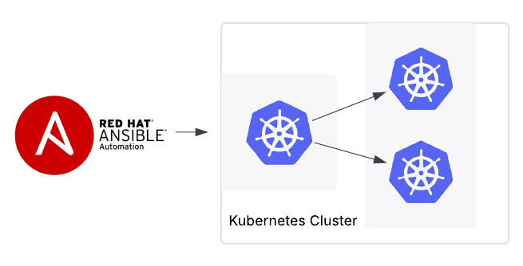

# Kubernetes (k8s) ansible setup
Ansible playbooks for setting up Linux servers and deploying Kubernetes (K8s).



Project Description

This repository contains Ansible playbooks designed to automate the deployment of a Kubernetes cluster using Kubeadm on Linux servers (specifically Ubuntu Server). The main objective of this project is to simplify and standardize the initial setup process of a Kubeadm cluster, from node preparation to the installation of core Kubernetes components. The playbooks handle the installation of necessary dependencies, configure operating system parameters, initialize the Kubeadm control plane, and join the worker nodes to the cluster. Configuration of Calico as the Container Network Interface (CNI) is also included.

Key Features

* Automated initial setup of Ubuntu Server hosts for cluster environments.
* Installation and configuration of necessary operating system prerequisites and dependencies for Kubernetes.
* Automated deployment of the Kubernetes Control Plane using Kubeadm.
* Automated joining and configuration of Worker Nodes to the existing Kubeadm cluster.
* Configuration of Calico as the Container Network Interface (CNI) solution for the cluster network.
* Management of SSH configuration, including automated SSH host key (known_hosts) handling for node-to-node or controller-to-node communication.
* Configuration of Firewall services on the nodes to ensure necessary cluster connectivity (e.g., managing firewalld or nftables).

## Prerequisites

Before using these Ansible playbooks to deploy your Kubernetes cluster, ensure your environment meets the following requirements:

### 1. Control Machine

The machine from which you will execute the `ansible-playbook` commands must have:

* **Operating System:** A compatible Linux-based system (e.g., Ubuntu, Fedora, CentOS/Oracle Linux, macOS, WSL on Windows).
* **Python 3.x:** Python version 3.x installed and correctly configured.
* **Ansible:** Ansible version [Specify minimum version if applicable, e.g., 2.10 or higher] or later installed.
    ```bash
    # Installation using pip (recommended in a virtual environment)
    python3 -m pip install ansible

    # Or installation via your distribution's package manager (e.g., on Ubuntu)
    # sudo apt update && sudo apt install ansible
    ```
* **Git:** Git installed to be able to clone this repository.
    ```bash
    # Installation using package manager (e.g., on Ubuntu)
    # sudo apt update && sudo apt install git
    ```
* **kubectl:** **It is not necessary to install `kubectl` manually beforehand.** The playbook will handle the installation of `kubectl` on the control machine (or an accessible location) as part of the deployment process. It will be needed to interact with the cluster *after* the playbook has finished.
* **SSH Key:** An SSH key pair (public and private) configured. The private key will be used to authenticate to the managed nodes. By default, Ansible uses `~/.ssh/id_rsa`.

  
